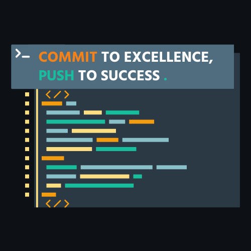

<div align="center">
  
  <h1 style="color: #18BD9C; letter-spacing: 3px; font-size: 25px; text-shadow: 2px 2px #000; font-family: 'Roboto', sans-serif; font-weight: 700; margin-top: 20px; margin-bottom: 20px;" >
    Hey, What's Up? 👋
  </h1>
</div>

### 🔍 Who am I ?

🎓 I am a 5th and last year engineering student in 𝗖𝗼𝗺𝗽𝘂𝘁𝗲𝗿 𝗦𝗰𝗶𝗲𝗻𝗰𝗲 𝗮𝗻𝗱 𝗠𝗮𝗻𝗮𝗴𝗲𝗺𝗲𝗻𝘁 (Expected graduation: July 𝟮𝟬𝟮𝟰) at 𝗣𝗢𝗟𝗬𝗧𝗘𝗖𝗛 𝗠𝗼𝗻𝘁𝗽𝗲𝗹𝗹𝗶𝗲𝗿 (a highly selective Engineering School in the South of France).

🚨 I'm currently on the hunt for an engaging 𝟱 𝘁𝗼 𝟲 𝗺𝗼𝗻𝘁𝗵 end-of-studies 𝗶𝗻𝘁𝗲𝗿𝗻𝘀𝗵𝗶𝗽 as a software engineer, in all regions of Switzerland, starting by February 15.

📚 Driven by a deep-seated passion for continual learning and personal development, I'm open to exploring various fields, such as 𝗱𝗮𝘁𝗮 𝘀𝗰𝗶𝗲𝗻𝗰𝗲, 𝗯𝗮𝗰𝗸𝗲𝗻𝗱 𝗱𝗲𝘃𝗲𝗹𝗼𝗽𝗺𝗲𝗻𝘁, and 𝘀𝗼𝗳𝘁𝘄𝗮𝗿𝗲 𝗲𝗻𝗴𝗶𝗻𝗲𝗲𝗿𝗶𝗻𝗴. If you have an opportunity that aligns with my ambitions, I'm eager to kickstart a conversation.

🌟 What truly excites me about programming is the chance to join forces with an awesome mix of brilliant minds from all walks of life. The software development journey is like a wild adventure, filled with collaborations and interactions with incredible folks from various departments. As someone who loves connecting with people and building meaningful relationships, being part of a team of passionate professionals all striving for the same goal is beyond cool. 🚀🌐🤝

<div style="display: flex; align-items: center; margin: 10px 0px 10px 0px; aligns; align-items: center; flex-direction: colomn; width: 100%;">

  

  <h2 style="margin-left: 10px; sans-serif; font-weight: 700; font-size: 20px; color: #18BD9C; letter-spacing: 3px; text-shadow: 2px 2px #000;">
    Me contacter 
  </h2>
</div>

<div>
    <a href="https://www.linkedin.com/in/ayoubhakemi" >
      
    </a>
    <a href="mailto:hakemi.ayoub.01@gmail.com">
      
    </a>
</div>

<div style="display: flex; align-items: center; margin: 10px 0px 10px 0px; align-items: center; flex-direction: colomn; width: 100%;">

  

  <h2 style="margin-left: 10px; sans-serif; font-weight: 700; font-size: 20px; color: #18BD9C; letter-spacing: 3px; text-shadow: 2px 2px #000;">
    A little more about me...
  </h2>
</div>


```javascript
const ayoubHakemi = {
  pronouns: "He" | "him",
  backend: ["NodeJs", "ExpressJs", "Java", "SpringBoot", "Sequelize"],
  frontend: [
    "HTML",
    "CSS",
    "SASS",
    "Javascript",
    "ReactJs",
    "RectNative",
    "VueJs",
    "Angular",
    "Bootstrap",
    "MaterialUI",
    "Tailwind",
    "JavaFX",
    "SwiftUI",
  ],
  database: ["Postgresql", "MySQL", "MongoDB", "Firebase"],
  cloud_server: ["Docker", "Heroku", "AWS", "Netlify"],
  architecture: [
    "microservices",
    "event-driven",
    "test-driven",
    "design system pattern",
    "security by design",
    "rest",
  ],
  challenge:
    "I am seaking to do an internship in a company that will allow me to develop my skills and learn new ones.",
};
```

<!--
**ayoubbibo/ayoubbibo** is a ✨ _special_ ✨ repository because its `README.md` (this file) appears on your GitHub profile.

Here are some ideas to get you started:

- 🔭 I’m currently working on ...
- 🌱 I’m currently learning ...
- 👯 I’m looking to collaborate on ...
- 🤔 I’m looking for help with ...
- 💬 Ask me about ...
- 📫 How to reach me: ...
- 😄 Pronouns: ...
- ⚡ Fun fact: ...
-->
