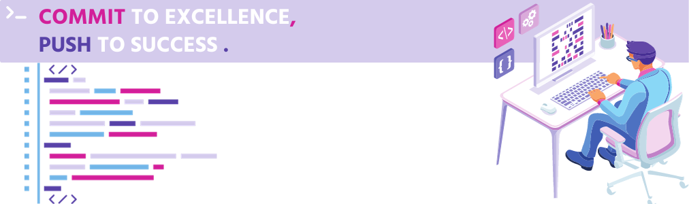

<div id="banner">
  
</div>

---

```console
ayoubBibo@github:~$ ./welcomeToMyProfile.sh
```


<div>
    <a href="https://www.linkedin.com/in/ayoubhakemi" >
      
    </a>
    <a href="mailto:hakemi.ayoub.01@gmail.com">
      
    </a>
</div>

```
🏫 5th and last year engineering student in 𝗖𝗼𝗺𝗽𝘂𝘁𝗲𝗿 𝗦𝗰𝗶𝗲𝗻𝗰𝗲 𝗮𝗻𝗱 𝗠𝗮𝗻𝗮𝗴𝗲𝗺𝗲𝗻𝘁

📍 At 𝗣𝗢𝗟𝗬𝗧𝗘𝗖𝗛 𝗠𝗼𝗻𝘁𝗽𝗲𝗹𝗹𝗶𝗲𝗿 (a highly selective Engineering School in the South of France)

🚨 I'm currently on the hunt for an engaging 𝟱 𝘁𝗼 𝟲 𝗺𝗼𝗻𝘁𝗵 end-of-studies 𝗶𝗻𝘁𝗲𝗿𝗻𝘀𝗵𝗶𝗽 as a software engineer, in all regions of Switzerland, starting by February 15

🔎 Main interests in Software Engineering, Data Science, and Management

🔭 Working currently on a project of a mobile application about the management of recrutement process for seasonal jobs using technologies like React Native, Spring Boot, PostgreSQl and Docker. 

🤝 If you have an opportunity that aligns with my ambitions, I'm eager to kickstart a conversation
```

<!--
**ayoubbibo/ayoubbibo** is a ✨ _special_ ✨ repository because its `README.md` (this file) appears on your GitHub profile.

Here are some ideas to get you started:

- 🔭 I’m currently working on ...
- 🌱 I’m currently learning ...
- 👯 I’m looking to collaborate on ...
- 🤔 I’m looking for help with ...
- 💬 Ask me about ...
- 📫 How to reach me: ...
- 😄 Pronouns: ...
- ⚡ Fun fact: ...
-->
